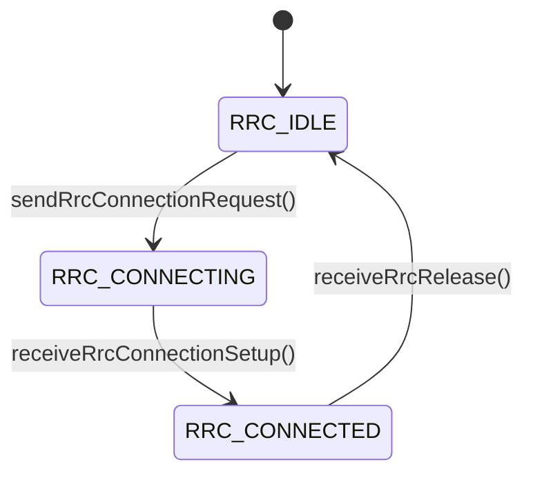

# 📡 LTE RRC Protocol Simulator

A C++ implementation of 3GPP TS 36.331 Radio Resource Control (RRC) protocol with PCAP logging capabilities for network analysis.

## 🌟 Features

| Feature | Description |
|---------|-------------|
| **Complete RRC State Machine** | Implements IDLE → CONNECTING → CONNECTED → IDLE transitions |
| **PCAP Logging** | Generates Wireshark-compatible packet captures for analysis |
| **Multi-threaded Simulation** | Realistic UE-Network interaction using threads |
| **Comprehensive Logging** | Timestamped text logs for both UE and Network |
| **3GPP Compliant** | Follows standard RRC message flows |

## 📂 Project Structure
```
lte-rrc-simulator/
├── include/
│   ├── NetworkRrc.hpp      # Network-side RRC implementation
│   ├── UeRrc.hpp           # UE-side RRC state machine
│   └── PcapLogger.hpp      # PCAP logging utility
├── src/
│   ├── NetworkRrc.cpp
│   ├── UeRrc.cpp
│   └── PcapLogger.cpp
├── Logs/                   # Generated logs and PCAPs
│   ├── ue_rrc_log.txt
│   ├── network_rrc_log.txt
│   ├── ue_rrc.pcap
│   └── network_rrc.pcap
└── main.cpp                # Simulation driver
```

## 🛠️ Build & Run

### Prerequisites
- C++17 compatible compiler
- libpcap development libraries
- CMake (optional)

### Building
```bash
# Clone repository
git clone https://github.com/yourrepo/lte-rrc-simulator.git
cd lte-rrc-simulator

# Build with CMake
mkdir build && cd build
cmake ..
make

# Or compile directly
g++ -std=c++17 -lpcap src/*.cpp main.cpp -o rrc_simulator
```

### Running
```bash
./rrc_simulator
```

## 📊 Expected Output

### Console Output
```
=== LTE RRC Simulator ===
Sent RRCConnectionRequest
Received RRCConnectionRequest
Sent RRCConnectionSetup
Received RRCConnectionSetup
Sent RRCConnectionComplete
Received RRCConnectionComplete
Sent RRCRelease
Received RRCRelease

Simulation complete. Check Logs/ for details.
```

### Log Files Example
```
[2025-03-26 22:24:20] Network RRC Layer initialized
[2025-03-26 22:24:20] [UE → Network] Received RRCConnectionRequest
[2025-03-26 22:24:21] [Network → UE] Sending RRCConnectionSetup
[2025-03-26 22:24:22] [UE → Network] Received RRCConnectionComplete
[2025-03-26 22:24:23] [Network → UE] Sending RRCRelease

[2025-03-26 22:24:20] UE RRC Layer initialized (State: IDLE)
[2025-03-26 22:24:20] [UE → Network] sent RRCConnectionRequest
[2025-03-26 22:24:21] [Network → UE] Received RRCConnectionSetup
[2025-03-26 22:24:22] [UE → Network] sent RRCConnectionComplete
[2025-03-26 22:24:23] [Network → UE] RRC Release received, back to IDLE
```

### PCAP Analysis
```
No. Time        Source          Destination     Protocol Length Info
1   0.000000    UE              Network         RRC      2      RRC Connection Request
2   1.000000    Network         UE              RRC      2      RRC Connection Setup
3   2.000000    UE              Network         RRC      2      RRC Connection Complete
4   3.000000    Network         UE              RRC      2      RRC Release
```

## 📚 Technical Documentation

### RRC State Machine


### Key Classes

#### `UeRrc`
- Implements UE-side RRC protocol
- Manages state transitions (IDLE/CONNECTING/CONNECTED)
- Generates RRC Connection Request/Complete messages

#### `NetworkRrc`
- Handles network-side RRC procedures
- Processes UE requests and sends responses
- Manages connection setup and release

#### `PcapLogger`
- Writes packet data to PCAP files
- Supports Wireshark analysis
- Uses DLT_RAW link type
